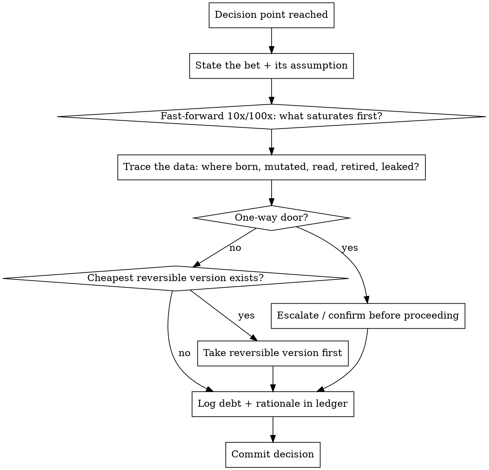

# Architectural Meta-Cognition

## Overview

**Core principle:** Think about the failure before it exists. Every design decision is a
bet against the future — make the bet explicit, then fast-forward to where it pays off or
blows up. Meta-cognition = running your own reasoning as a system under test.

This module fires *before a single line is written* and re-fires at every decision point.
It produces four artifacts: a **debt ledger**, a **data-lifecycle trace**, a **scale-limit
table**, and an **edge-case matrix**.

## When to use

- About to lock a design decision (storage, boundary, protocol, dependency).
- A choice "feels fine" but has not been stress-tested in your head.
- Someone asks "will this scale / what breaks / what's the catch."
- Before EnterPlanMode — meta-cognition feeds the plan.

## Protocol A — Self-interrogation loop (run on EVERY decision)



## Protocol B — Technical-debt foresight (Fowler quadrant)

Classify every shortcut **at the moment you take it**. Only one quadrant is acceptable
without escalation.

| | Prudent | Reckless |
|---|---|---|
| **Deliberate** | "We ship now, refactor in N; here's the trigger." → **OK, log it.** | "No time for design." → **STOP. This is the failure you warned about.** |
| **Inadvertent** | "Now we know how we should have done it." → learning, refactor when touched. | "What's layering?" → knowledge gap, fix the gap first. |

**Debt-ledger entry (write one per shortcut):**
```
DEBT: <what is suboptimal>
WHY:  <reason it was acceptable now>
COST: <what it makes harder later, and to whom>
TRIGGER: <the observable signal that says "pay it down now">
PAYOFF PATH: <the concrete refactor that clears it>
```
Debt with no TRIGGER is not deliberate — it is reckless debt wearing a disguise.

## Protocol C — Data lifecycle trace (CRUD-PRL)

For every significant datum, answer all seven. A gap here is a future incident.

| Stage | Question | Failure if unanswered |
|---|---|---|
| **C**reate | Where is it born? What validates it at the door? | Garbage in, propagated everywhere. |
| **R**ead | Who reads it, on which path (hot/cold)? | Hidden I/O on the hot path. |
| **U**pdate | Who mutates it? Is the write atomic? Concurrent? | Race conditions, torn writes. |
| **D**elete | When is it retired? Cascade? Tombstone? | Orphans, dangling refs, leaks. |
| **P**rovenance | Can you reconstruct *why* it has this value? | Undebuggable state. |
| **R**etention | How long must/may it live? Legal/privacy? | Compliance + unbounded growth. |
| **L**eak | Where could it escape (logs, errors, caches, metrics)? | Secret/PII exposure. |

**Rule:** return value and persisted state MUST agree. If a method returns a set and writes
a cache, they describe the same fact or one of them is a bug.

## Protocol D — Scale-limit interrogation

Don't ask "is it fast." Ask **"which resource saturates first, and at what multiple?"**

```
For load × {10, 100, 1000}:
  1. Which resource hits its ceiling first? (CPU, mem, IO, conns, locks, fanout, a single row)
  2. What is the dominant complexity term on the hot path? (drop constants; find the N^2 or the N+1)
  3. Where is the serialization point? (the lock/queue/leader everything funnels through)
  4. What is the blast radius when it tips? (graceful degrade vs cliff)
```

Fill the table; the first row to turn red is your real architecture problem.

| Multiple | First to saturate | Dominant term | Serialization point | Degrade or cliff? |
|---|---|---|---|---|
| 10x | | | | |
| 100x | | | | |
| 1000x | | | | |

## Protocol E — Edge-case generation matrix

Generate cases *systematically*, not by imagination. Sweep every axis:

- **Boundary:** 0, 1, max, max+1, empty, single, full, off-by-one.
- **Null/absent:** missing field, null, undefined, empty string vs absent, default vs explicit.
- **Type/shape:** unicode, huge input, negative, NaN/Inf, mixed encoding, malformed.
- **Temporal:** clock skew, DST, leap, timeout, retry, stale read, out-of-order arrival.
- **Concurrency:** two writers, write-during-read, reentrancy, partial failure mid-batch.
- **Ordering:** events arrive reversed; idempotency under duplicate delivery.
- **Resource:** disk full, OOM, conn pool exhausted, dependency down/slow.
- **Adversarial:** injection, oversized payload, replay, the input crafted to break you.

For each generated case: **expected behavior + where it is enforced.** A case with no
enforcement point is an unhandled edge.

## Red flags — STOP and run the protocol

- "It'll probably be fine at scale." → Run Protocol D. Name the first saturation.
- "We'll handle edge cases later." → Run Protocol E now; later = never.
- "This is temporary." → No debt-ledger entry = reckless debt. Write the TRIGGER.
- "The data just flows through." → Run the CRUD-PRL trace; find the leak/orphan.
- "I'll just change this and that." → Two changes; you've lost attribution. One at a time.
- Choosing a one-way-door design casually. → Escalate or find the reversible version first.

## Common mistakes

- **Optimizing the wrong term.** Tuning a constant factor while an N² lurks. Find the
  dominant term first.
- **Imagining edge cases.** Ad-hoc brainstorming misses classes. Sweep the matrix.
- **Untracked debt.** "Temporary" code with no trigger becomes permanent. Ledger it.
- **Inspection as proof.** "It clearly does no I/O" — instrument and count instead.
