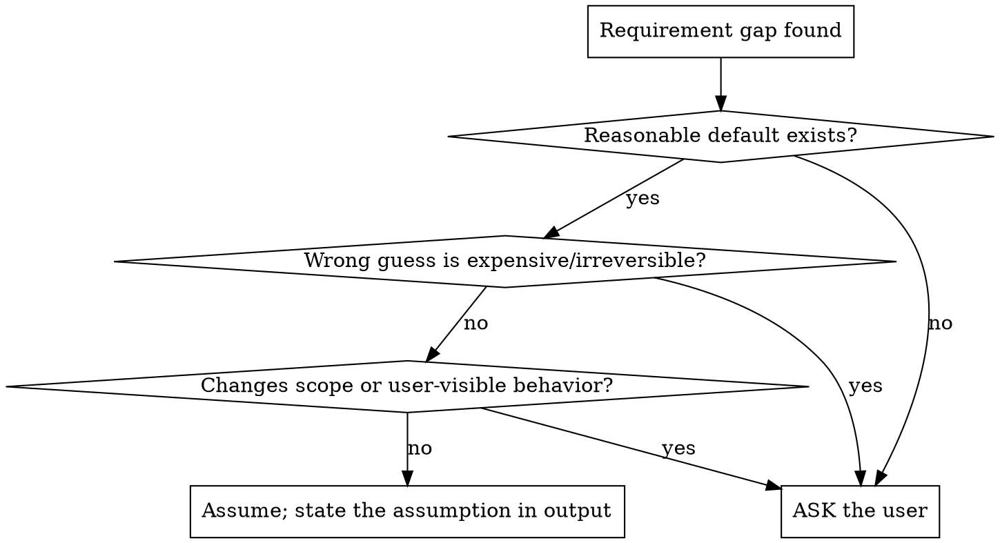

# Brainstorming & Modeling

## Overview

**Core principle:** A request is the tip; the iceberg is the implicit requirements. The job
is to convert a raw idea into an explicit problem statement, a domain model, and acceptance
criteria — *before* any plan exists. The user told you WHAT they noticed; you must recover
WHAT they actually need.

**Output of this module:** (1) one-sentence problem statement, (2) in/out-of-scope lists,
(3) domain model (entities, relationships, invariants, state machine), (4) explicit list of
recovered implicit requirements, (5) acceptance criteria.

## When to use

- Any "build / add / make X" where X is one line.
- Scope feels fuzzy or you notice yourself inventing details.
- Before EnterPlanMode for anything non-mechanical.
- A request that names a *solution* — recover the underlying *problem* first.

## Protocol A — Intent extraction (the five cuts)

Interrogate the raw idea along five axes. Answer each or mark it UNKNOWN.

```
WHAT  — the observable behavior wanted, in one sentence, no solution words.
WHY   — the underlying goal. Ask "so that…?" up to 3 times to reach root motive.
WHO   — actors/roles, and who is explicitly excluded.
WHEN  — triggers, frequency, lifecycle, ordering relative to other events.
BOUND — constraints: budget, deadline, tech, compliance, existing system to fit.
```

**Solution-to-problem inversion:** if the ask is "add a Redis cache," the WHAT is "reads on
path P are too slow," not "Redis." Solve the WHAT; the named solution is a hypothesis.

## Protocol B — Implicit-requirement sweep (the unstated default catalog)

Most requirements are never spoken because the user assumes them. Sweep every class; for
each, state the recovered requirement or explicitly mark N/A.

| Class | The unspoken question | Default if user is silent |
|---|---|---|
| **Auth** | Who's allowed? Authn vs authz? | Deny by default; least privilege. |
| **Validation** | What's a valid input at the boundary? | Reject malformed at the door. |
| **Errors** | What happens on failure — surface, retry, fall back? | Fail visibly; never swallow. |
| **Concurrency** | Two of these at once? Idempotent? | Assume concurrent; design idempotent. |
| **Persistence** | Survive restart? Source of truth? | Durable unless explicitly ephemeral. |
| **Observability** | How will we see it working/failing? | Log decisions + errors; emit counts. |
| **Scale** | Expected volume; growth? | Ask; don't assume "small." |
| **Security/PII** | Secrets, personal data, leak surfaces? | Treat as sensitive; never log raw. |
| **Performance** | Latency budget? Hot path? | Cheapest path first; heavy I/O off-hot. |
| **Compatibility** | Existing API/data to not break? | Additive, backward-compatible. |
| **Degradation** | Behavior when a dependency is down? | Degrade gracefully, offline-tolerant. |
| **i18n / a11y** | Locales, encodings, accessibility? | UTF-8; ask if user-facing. |
| **Lifecycle** | Create→update→delete→retention? | Run the data-lifecycle trace ([01]). |

**Rule:** every row is either a recovered requirement or an explicit N/A. A blank row is an
assumption you didn't know you made.

## Protocol C — Domain modeling

Turn the problem into a structure before turning it into code.

1. **Entities** — the nouns. Each gets a name, identity, and the data it owns.
2. **Relationships** — how nouns connect (1:1, 1:N, N:M); ownership and cascade direction.
3. **Invariants** — facts that must ALWAYS hold ("balance ≥ 0", "a reconciled block keeps
   its original text"). Invariants become assertions and tests.
4. **State machine** — for anything with lifecycle: enumerate states + legal transitions.
   An unreachable state or a missing transition is a bug spec.

```
entity ─owns─▶ data
   │
   └─relates(1:N)─▶ entity
        guarded by ─▶ invariant ─becomes─▶ test + assertion
   lifecycle ─▶ [stateA] ──event──▶ [stateB] ──event──▶ [stateC]
                    ▲___________illegal?___________│   (mark forbidden transitions)
```

## Protocol D — Ask vs assume

You cannot ask about everything. Decide per gap:



Batch questions — ask the 2–4 highest-leverage unknowns at once, not a drip of one-at-a-time.

## Output template (the brainstorm artifact)

```
PROBLEM: <one sentence, problem not solution>
WHY:     <root motive>
IN SCOPE:    <bullets>
OUT OF SCOPE: <bullets — explicit exclusions prevent scope creep>
DOMAIN: entities / relationships / invariants / state machine
RECOVERED IMPLICIT REQUIREMENTS: <from Protocol B sweep>
ASSUMPTIONS (proceeding without asking): <each one, falsifiable>
OPEN QUESTIONS (must ask): <2–4 highest-leverage>
ACCEPTANCE CRITERIA: <observable, testable pass conditions>
```

## Red flags — STOP

- You're writing code and the problem statement isn't one sentence yet.
- You invented a detail the user never gave → it's an assumption; log or ask it.
- The ask names a tool/library → you're solving a hypothesis, not the problem.
- A Protocol-B row is blank → silent assumption.
- "Obviously they want…" → obvious to you ≠ stated. Make it explicit.

## Common mistakes

- **Building the literal request.** "Add a button" when the need was "users can't find X."
- **Skipping out-of-scope.** Undeclared exclusions invite scope creep mid-build.
- **Modeling in code first.** Entities/invariants on paper catch contradictions cheaply.
- **One question at a time.** Wastes round-trips; batch the high-leverage unknowns.
