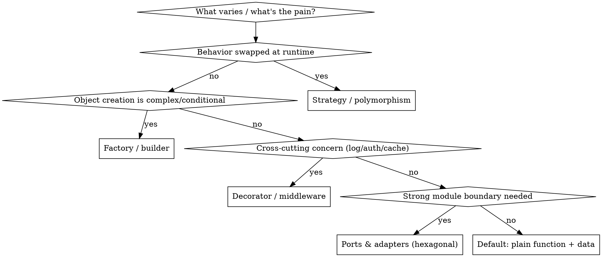

# Architectural Planning

## Overview

**Core principle:** A great plan makes execution mechanical. Write it for an implementer with
**zero context for the codebase and questionable taste** — every signature confirmed, every
constraint repeated, every step carrying complete code. Planning is where unexamined
assumptions die cheaply instead of expensively at merge.

**Output:** a plan document (structure below) + an ADR for each non-obvious decision.

## When to use

- Brainstorm artifact exists; ready to decide the *how*.
- Choosing patterns, directory layout, module boundaries, or dependencies.
- Before EnterPlanMode / before dispatching any implementer.

## Protocol A — Pre-flight (do BEFORE writing any task)

Non-negotiable. Read **every file the plan will touch** and every pattern it claims to mirror.

```
1. CONFIRM REAL SIGNATURES — open the code; copy exact names/shapes. A method called
   clearLayers() in one task and clearFullLayers() in another is a bug you ship blind.
2. FIND THE TESTS THAT WILL BREAK — a deliberate behavior change silently breaks tests
   asserting the old contract. Grep them; write MIGRATION steps into the plan.
3. VERIFY MIRRORED PATTERNS EXIST — don't trust the spec's claim that "X mirrors Y";
   open Y. If it's absent, correct the plan, not the implementer at runtime.
```

## Protocol B — Pattern selection (decision tree, not cargo cult)

Pick the *simplest* pattern that satisfies the forces. A pattern is a cost; pay it only for
the problem it solves.



**Rule:** if you can't name the force a pattern resolves, don't use the pattern. "Plain
function + data" is the correct default; abstraction is earned, not pre-paid (YAGNI).

## Protocol C — Directory structure rules

1. **Organize by feature/domain, not by layer.** `order/` (with its model, service, api)
   beats `controllers/ services/ models/` split across the domain. The tree should
   *scream the domain*, not the framework.
2. **One responsibility per file.** Name = responsibility. If you can't name it in a noun
   phrase, it does too much.
3. **Dependencies point inward.** Domain core depends on nothing; adapters depend on core;
   nothing in the core imports an adapter. Enforce the import direction.
4. **Mirror existing layout.** A new module matches the conventions already in the repo —
   confirmed in pre-flight, not assumed.

```
feature/
  model.*      # entities + invariants (no I/O)
  service.*    # use-cases (orchestrates model; no framework)
  adapter.*    # I/O, DB, network (depends inward only)
  <feature>_test.*
```

## Protocol D — Constraint codification

Turn design decisions into rules an implementer cannot accidentally violate.

| Constraint type | How to state it in the plan |
|---|---|
| Dependency direction | "X may import Y; Y must NOT import X." |
| Boundary / interface | Define the interface signature first; implementations conform. |
| Performance | "Heavy I/O off the hot path; reflect() does 0 network calls — verify empirically." |
| Standing project rules | Repeat verbatim (RAM limits, `python3` not `python`, commit trailer). |
| Accepted trade-offs | List ratified reviewer caveats so nobody "fixes" intended behavior. |

## Protocol E — Plan document structure

```
# <Feature> Implementation Plan
> REQUIRED SUB-SKILL: subagent-driven-development (or executing-plans)
Goal:         one sentence
Architecture: 2–3 sentences
Tech Stack:   key libs

## Standing constraints      (the non-negotiables, repeated here)
## Design decisions locked   (deviations from spec + RATIONALE)
## Accepted trade-offs        (reviewer caveats folded as ratified, NOT defects)
## File Structure             (table: each file → one responsibility)
## Task N:                    (bite-sized TDD; complete code per step; see below)
## Self-Review                (spec coverage / placeholder scan / type consistency)
```

**Task granularity — bite-sized TDD, complete code in every step:**
```
1. Write the failing test (full code, not "write tests for the above")
2. Run it → expected FAIL message
3. Write minimal implementation (full code)
4. Run it → expected PASS (with count)
5. Run regressions (named files, one process each)
6. Commit (exact message + trailer)
```
**No placeholders ever.** "TBD", "add error handling", "similar to Task N" are plan
failures. If a step changes code, the code is present.

## Protocol F — ADR (one per non-obvious decision)

```
# ADR-NNN: <decision title>
Status:   proposed | accepted | superseded-by ADR-MMM
Context:  the forces — what makes this non-trivial.
Decision: what we chose, stated as a rule.
Alternatives: what we rejected + why (one line each).
Consequences: what this makes easy, what it makes hard, the debt it incurs.
```

## Red flags — STOP

- Writing tasks before reading the files they touch → pre-flight skipped.
- A pattern with no named force it resolves → speculative abstraction.
- "TBD" / "handle edge cases" / "similar to above" in a task → placeholder; finish it.
- A behavior change with no test-migration step → a silent merge-time break.
- Layer-first directories on a domain app → the framework is screaming, not the domain.

## Common mistakes

- **Trusting the spec's claims about the code.** Verify in pre-flight; specs drift.
- **Pre-paying abstraction.** Build the plain version; abstract when a second case lands.
- **Constraints stated once.** Repeat the non-negotiables inside each task.
- **Plan as prose.** A plan an implementer can't execute step-by-step isn't a plan.
