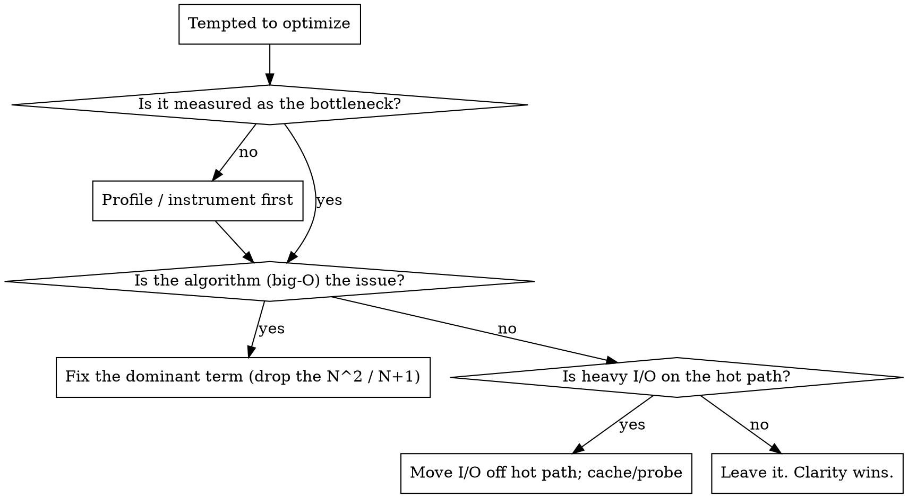

# Execution (Coding)

## Overview

**Core principle:** Code is read far more than written. Optimize for the next reader (often a
cold agent). Correct + boring + matches-the-codebase beats clever. Every line is either
tested behavior or a liability.

**Default discipline: TDD.** Failing test → minimal code → pass → refactor. No production
code without a failing test first, unless the user's instructions override.

## When to use

- Any feature, bugfix, or refactor.
- A function or file is growing; you feel the urge to "just add one more thing."
- Tempted to add an abstraction "for later," or to skip a test "just this once."

## Protocol A — The execution loop (per unit of behavior)

```
RED    → write the failing test that states the contract. Run it. See it fail for the
         RIGHT reason (asserts the behavior, not a typo).
GREEN  → minimal code to pass. No extra. Run it. See it pass (with count).
REGRESS→ run the tests that depended on touched behavior, one process each.
REFACTOR→ remove duplication, improve names — tests stay green throughout.
COMMIT → one reviewed unit = one commit (+ trailer).
```

## Protocol B — SOLID as enforceable checks (not slogans)

| Principle | Operational check (fail = refactor) |
|---|---|
| **S**ingle Responsibility | Can you name the unit's job in one noun phrase, no "and"? If not, split. |
| **O**pen/Closed | Adding a variant means adding a case/impl, not editing a switch in 5 files. |
| **L**iskov | A subtype is droppable wherever the base is, with no caller `isinstance` checks. |
| **I**nterface Segregation | No implementer is forced to stub methods it doesn't use. Split fat interfaces. |
| **D**ependency Inversion | High-level code depends on an abstraction; the concrete I/O is injected, not imported. |

## Protocol C — Non-negotiable coding rules

1. **Functions do one thing.** Short. If you scroll to read it, it's two functions.
2. **Pure core, imperative shell.** Push I/O to the edges; keep logic pure and testable.
   Heavy/optional I/O (network, embeddings) sits behind a probe, off the hot path.
3. **Guard clauses, fail fast.** Validate at the boundary; return/raise early; no deep nesting.
4. **Errors are visible.** Never swallow. Either handle meaningfully or propagate with context.
   No bare `except:`; no empty catch.
5. **Names carry intent.** `reconciled_blocks` not `data2`. A name that needs a comment is the
   wrong name.
6. **No magic values.** Named constant or config; explain non-obvious thresholds at the def.
7. **Return value == persisted state.** If you return a set and write a cache, they agree.
8. **Determinism in tests.** Stub the expensive boundary with hand-placed values — but ensure
   the stub doesn't *mask* the behavior under test (antipodal vs orthogonal vectors).
9. **Document deliberate behavior changes** at the function and in docs, so a future reader
   doesn't "fix" them.
10. **Match the surrounding code.** Idiom, naming, comment density, error style. The right
    answer that looks foreign is half-wrong.

## Protocol D — Performance discipline (measure, don't guess)



Rules: **cheapest path first** (fast deterministic check short-circuits before the expensive
one); **complexity budget** — know the dominant term before you write the loop; **prove the
win empirically** — count the calls / time it, don't assert it.

## Protocol E — Refactor safety

- Refactor only under green tests. Behavior-preserving change must keep tests passing every step.
- A deliberate behavior change → **migrate** the test to assert the new contract; never
  delete/skip a test to make red go green.
- One logical change per commit; never bundle a refactor with a behavior change.

## Red flags — STOP and start over

- Writing implementation before a failing test exists (unless user said no-TDD).
- "I'll add error handling later." → later = the incident. Add it now.
- A function you must scroll to read. → split it.
- An abstraction with exactly one caller and no second case in sight. → YAGNI; inline it.
- Editing a test to make it pass instead of fixing the code. → the bug is still there.
- `except Exception: pass`. → you just hid a future 3am page.
- Claiming it works without running it. → evidence before assertion.

## Common mistakes

- **Speculative generality.** Frameworks for one use case. Build the concrete thing.
- **Clever over clear.** The one-liner nobody can debug. Prefer the boring three lines.
- **Swallowed errors.** Silent failure is the most expensive failure.
- **Untested edge.** The happy path is 20% of the bugs. Test the boundary and the failure.
