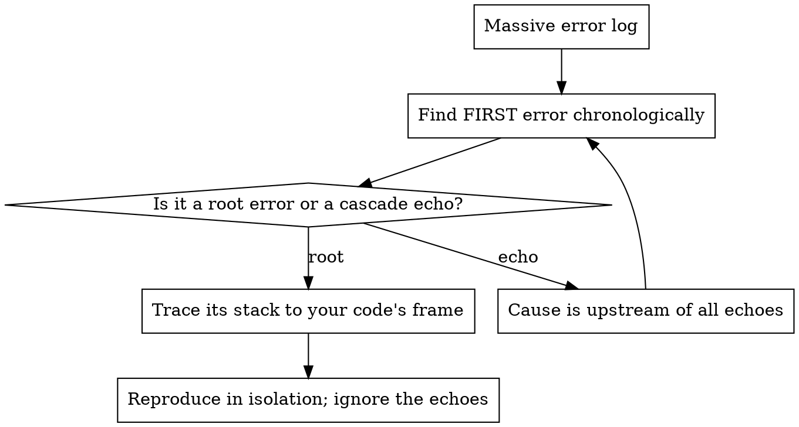

# Complex Debugging

## Overview

**Core principle:** A bug is a falsified assumption. Find which assumption is false by
*shrinking the search space*, not by guessing fixes. Never change two things at once — that
destroys attribution. The fix is the last step, not the first.

**The cardinal rule:** reproduce → isolate → root cause → fix → prove. Skipping to "fix"
produces a patched symptom and a still-live cause.

## When to use

- Any failing test, crash, wrong output, or flake.
- A wall of red terminal output you're tempted to skim.
- "It passes locally / sometimes" — timing or environment dependence.
- You already tried a fix and it didn't work (you're now guessing).

## Protocol A — The diagnostic funnel (RCA)

```
1. REPRODUCE      Make it fail on demand. A bug you can't reproduce, you can't fix —
                  you can only hope. Capture the exact command + inputs + environment.
2. READ THE FIRST ERROR, NOT THE LAST. In a wall of logs, the root cause is usually the
                  earliest failure; later lines are its echoes. Find the first real error.
3. ISOLATE        Shrink to the minimal reproducer. Strip code until it stops failing —
                  the last thing you removed is implicated.
4. BISECT         Binary-search the space: git bisect across commits; comment-halving across
                  code; midpoint logging across a pipeline. Halve the suspect region each step.
5. HYPOTHESIZE    State the falsifiable assumption you think is false: "I believe X holds at
                  line L." One hypothesis at a time.
6. INSTRUMENT     Add a probe that proves/disproves the hypothesis (log the value, count the
                  calls, assert the invariant). Observe — don't fix yet.
7. CONFIRM CAUSE  The probe must show the exact false assumption. If it doesn't, the
                  hypothesis was wrong → back to step 5. Do NOT proceed on a maybe.
8. FIX THE CAUSE  Change ONE thing — the cause, not the symptom.
9. PROVE          Reproducer now passes; add a regression test that fails without the fix;
                  run named regressions. Remove the probes.
```

## Protocol B — Log triage (taming the wall of red)



Triage rules: filter to your own frames first; `N occurrences` of one message = one bug, not
N; a timeout downstream is often a hang upstream. For large outputs, process them through a
tool that returns a summary — don't pour 5,000 lines into working memory.

## Protocol C — Async / race-condition protocol

Races are assumptions about ordering that don't hold. Attack the ordering, not the symptom.

| Symptom | Likely cause | Probe |
|---|---|---|
| Passes alone, fails in suite | Shared mutable state / test pollution | Run isolated; diff the global state. |
| Passes sometimes | Unsynchronized access / ordering assumption | Add ordering logs with timestamps + thread/task id. |
| Hangs intermittently | Deadlock / await never resolves | Dump pending tasks; find the unawaited / circular wait. |
| Works slow, breaks fast | Time-based wait (`sleep`) instead of condition-based | Replace with wait-for-condition. |

**Rules:** never "fix" a race by adding a sleep — that hides it. Make the wait
*condition-based*. Reproduce by *amplifying* the race (loop it, add jitter, reduce timeouts).
A bounded window often self-resolves — confirm the bound is the resolution, don't add a guard
on top.

## Protocol D — No-side-effect discipline

```
- ONE change at a time. Two edits = no attribution; revert to one.
- Probes are READ-ONLY. Logging/asserting observes; it must not alter behavior.
- Keep a change log: each probe/edit + what it proved. Revert dead-end probes.
- Never edit the test to silence red unless the test itself encoded the wrong contract
  (and then it's a deliberate, documented migration).
- Work on a branch / stash baseline so you can always return to known state.
```

## Protocol E — When stuck (the loop-breakers)

After 2 failed hypotheses, change tactic — don't re-try the same guess louder:

1. **Re-reproduce from scratch** — maybe you fixed a different thing.
2. **Challenge the premise** — is the "expected" behavior actually correct?
3. **Rubber-duck the data flow** — trace one value end-to-end ([01] CRUD-PRL).
4. **Diff against last-known-good** — `git bisect` or compare with a working sibling.
5. **Widen, then narrow** — add coarse probes everywhere, find the half that's wrong, delete the rest.

## Red flags — STOP

- Applying a fix before you've confirmed the cause. → you're guessing; instrument first.
- "Let me just try changing this." → and that, and that — attribution gone. One variable.
- Reading the last error and skipping the first. → you're debugging the echo.
- Adding `sleep()` to fix flakiness. → race hidden, not fixed.
- Editing the test until green. → the bug shipped.
- "It works now" with no regression test. → it'll regress; lock it with a test.

## Common mistakes

- **Symptom patching.** Suppressing the error message instead of removing its cause.
- **Inspection as proof.** "It can't be null here" — add the assert and find out.
- **Cascade chasing.** Debugging echo errors while the root sits untouched at the top.
- **Heisenbug by edit.** Changing many things so the bug "moves"; you never learn the cause.
