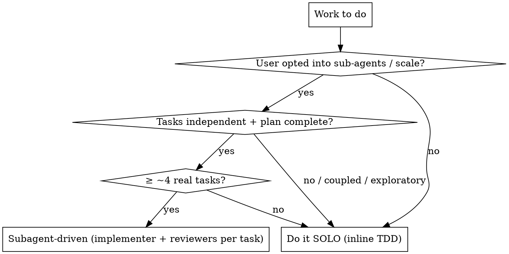

# Orchestration

## Overview

**Core principle:** The orchestrator's scarce resource is its own context. Spend sub-agents to
keep coordination context clean and to isolate each task's context. A sub-agent gets
*everything it needs and nothing it doesn't*, does one fully-specified thing, and reports in a
fixed shape. The orchestrator never trusts a report — it triages.

**Spawn only when the user opted into that scale.** Default to solo for small work.

## When to use

- Scope is large: many files, many independent tasks, a real plan.
- You need isolated context per task + review checkpoints.
- A long multi-task run where your own context would otherwise fill with implementation detail.

## Protocol A — Spawn vs solo (decide first)



Sub-agents cost tokens (1 implementer + reviewers each). Pay it when isolation + early
review-catch is worth more than the tokens. A fresh cold agent for a two-line fix is waste.

## Protocol B — Decompose scope into micro-tasks

Each micro-task must be **INVEST-shaped for agents**:

| Property | Test |
|---|---|
| **Independent** | Can run without another in-flight task's output. No shared mutable state. |
| **Single-responsibility** | One contract; nameable in a sentence, no "and". |
| **Fully specified** | Complete code/test in the task; no "TBD", no "similar to Task N". |
| **Verifiable** | Has its own pass condition (test + expected count). |
| **Bounded context** | The agent needs ≤ what fits comfortably; pre-extract the signatures it must mirror. |
| **Sequenced if dependent** | If B needs A's interface, define A's interface in the plan so both can mirror it. |

Cut along **seams** (module/interface boundaries), not arbitrarily. A good cut means two
agents touch disjoint files.

## Protocol C — Dispatch prompt anatomy (never make the agent read the plan file)

Give the sub-agent everything inline; the plan file stays with the orchestrator.

```
1. STANDING CONSTRAINTS  — the non-negotiables verbatim (test limits, tool quirks, trailer).
2. CONTEXT / SCENE       — where this task fits; what already exists; key gotchas
                           ("preserve X across re-adds", "import Y lazily to avoid a cycle").
3. FULL TASK             — the TDD steps with complete code pasted in.
4. REPORT FORMAT         — Status (DONE / DONE_WITH_CONCERNS / BLOCKED / NEEDS_CONTEXT),
                           what changed, exact test counts, commit SHA, self-review.
```

## Protocol D — The review loop (per task)

Order is fixed: **implementer → spec-compliance review → code-quality review.** Spec first
("built the right thing?"), quality second ("built it well?"). Never start quality review
while spec review has open issues.

```
implementer ─▶ spec review ─clean?─▶ quality review ─clean?─▶ next task
     ▲              │ issues             │ issues
     └────fix───────┘                    └────fix──┘
```

## Protocol E — Handle status honestly

| Status | Action |
|---|---|
| DONE | Proceed to spec review. |
| DONE_WITH_CONCERNS | Read the concern. A legit registry-completeness 4th-file touch is fine; a correctness doubt is not. |
| NEEDS_CONTEXT | Provide it; re-dispatch. |
| BLOCKED | Change something — more context, stronger model, smaller task, or escalate. **Never retry the same model unchanged.** |

## Protocol F — Triage findings (the real skill)

**A review is input, not a verdict.** Do not auto-apply every finding. Verify each against the code.

| Category | Action |
|---|---|
| Real bug (verified) | Fix it. |
| Real gap (missing test for a load-bearing invariant) | Add the test. |
| Design-judgment (defensible either way) | Ratify + document, OR escalate if it changes approved behavior. Don't redesign mid-flight. |
| Nit (style/DRY) | Fold if cheap & valuable; else skip with a one-line rationale. |
| False positive (reviewer misread) | Reject with the file:line that disproves it. |

## Protocol G — Fix-loop economics

- Can continue the **same** implementer (full context)? Do that.
- No continue mechanism, fix is **trivial/mechanical**, you have full context? Apply **inline** —
  don't rebuild a cold agent's context for two lines.
- Fix is **substantive** and you lack context? Dispatch a fresh fix agent or escalate. Don't
  pollute coordination context with deep implementation.
- Commit hygiene: `git commit --amend --no-edit` to keep one reviewed commit per task (local-only).

## Protocol H — Track durably

Use a task tracker (TodoWrite / Task tools). It survives context compaction across a long run
and shows the human where you are.

## Red flags — STOP

- About to spawn agents the user never asked for. → solo unless they opted into scale.
- Sending an agent to "read the plan." → inline its slice; isolate context.
- Trusting "all green" without reading the diff and re-running. → verify, always.
- Auto-applying every reviewer finding. → triage; reject false positives with file:line.
- Re-dispatching a BLOCKED task to the same model unchanged. → change a variable.
- Spawning a cold agent for a five-second fix. → inline it.

## Common mistakes

- **Over-isolation thrash.** Cutting tasks so fine that coordination cost exceeds the work.
- **Coupled "independent" tasks.** Two agents editing the same file → merge conflict + drift.
- **Quality-before-spec review.** Polishing code that solves the wrong problem.
- **Report-as-truth.** The agent's summary is a claim; the diff + a re-run is the evidence.
