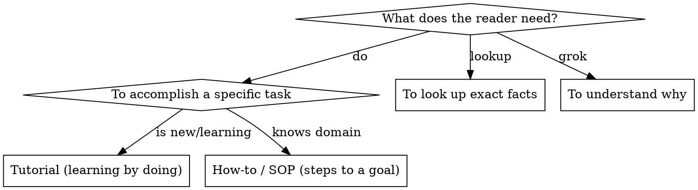

# Writing & Documentation

## Overview

**Core principle:** Documentation is for a reader with zero context and a specific goal. Match
the document to the goal (Diátaxis), front-load what the reader needs, and **verify every
factual claim against the implementation** before publishing. Docs that drift from code are
worse than no docs — they actively mislead.

## When to use

- Writing/updating a README, SOP, runbook, design doc, ADR, or API reference.
- Docs may have drifted from the code (markers, env vars, signatures, counts changed).
- A reader must perform an action from the doc without asking you.

## Protocol A — Pick the document type (Diátaxis)

Mixing types is the #1 doc failure. One document, one job.



| Type | Reader goal | Voice |
|---|---|---|
| Tutorial | Learn by doing | "We will…" guided, guaranteed success path |
| How-to / SOP | Achieve a known goal | Imperative steps, preconditions, verification |
| Reference | Look up a fact | Dry, exhaustive, consistent, scannable |
| Explanation / ADR | Understand a decision | Discursive, trade-offs, context |

## Protocol B — README structure (bulletproof order)

Front-load value; a reader decides in 10 seconds whether to continue.

```
1. NAME + one-line what-and-why     (no marketing; what problem it kills)
2. Status / version                 (so the reader trusts currency)
3. Quickstart                       (copy-pasteable: install → run → see it work)
4. Core concepts                    (the 3–5 nouns the reader must hold)
5. Usage / common tasks             (recipes, each independently runnable)
6. Configuration                    (table: option → effect → default)
7. Architecture (brief)             (the one diagram + the boundary rules)
8. Troubleshooting                  (symptom → cause → fix)
9. Contributing / constraints       (the non-negotiables; how to run tests)
10. License
```

## Protocol C — SOP / runbook structure (for an operator under stress)

```
TITLE: <action> — when to run this
PRECONDITIONS: what must be true first (access, state, backups)
SAFETY: what is irreversible here; the abort/rollback step
STEPS:
  N. <imperative action>
     EXPECT: <observable result that confirms success>
     IF NOT: <the branch — what to check, where to escalate>
VERIFY: the end-state check that proves the goal is met
ROLLBACK: exact steps to return to the prior known-good state
```
**Rule:** every step has an EXPECT and an IF-NOT. A step you can't verify is a step that
silently failed.

## Protocol D — The structure that fits every technical doc

```
HOOK     — one sentence: what this is + who it's for.
CONTEXT  — the minimum prior knowledge; link, don't inline, deep background.
BODY     — chunked by reader task; each chunk independently useful; tables for facts,
           numbered lists for sequences, flowcharts only for non-obvious decisions.
EXAMPLE  — one complete, real, runnable example (not a fill-in-the-blank template).
EDGES    — failure modes, limits, gotchas, "what NOT to do."
NEXT     — where to go from here.
```

## Protocol E — Verify-against-code (the non-negotiable pass)

Before publishing, re-check every factual claim against the implementation:

```
- Signatures / names      — copy from the source, don't recall from memory.
- Commands / flags         — run them or read --help; don't invent options.
- Env vars / constants     — grep the code; match exact spelling/case.
- Counts / metrics          — "56 tests" must be the number the suite reports today.
- File paths               — confirm they exist at the path you wrote.
- Behavior claims          — "does no network I/O" → verified empirically, not assumed.
```
A claim you can't trace to code is a guess; mark it or cut it.

## Protocol F — Discoverability (so the doc is found)

- **Name by what it does**, verb-first (`creating-skills`, not `skill-creation`).
- Use the words a searcher would type: error strings, symptoms, synonyms, tool names.
- For skill/reference files: a `description` that states **when to use**, not what it does —
  a workflow summary in the description becomes a shortcut the reader follows instead of the body.
- Put searchable terms early and often.

## Red flags — STOP

- The doc states a flag/signature/count you didn't verify against code. → verify or cut it.
- One document doing tutorial + reference + explanation at once. → split by reader goal.
- An SOP step with no EXPECT / IF-NOT. → unverifiable; the operator flies blind.
- A README whose quickstart isn't copy-pasteable. → the reader bounces in 10 seconds.
- A fill-in-the-blank "template" example. → give one real, runnable example instead.
- Description summarizes the workflow. → reader follows the summary, skips the body.

## Common mistakes

- **Drift.** Docs written once, code moved on. Re-verify factual claims at every edit.
- **Type-mixing.** Burying reference facts inside a tutorial narrative; nobody can look them up.
- **Narration over reference.** "How we solved it once" instead of "how to do it." Write the reusable form.
- **Inlining deep background.** Bloats the doc; link it and keep the body on-task.
- **No failure section.** Happy-path-only docs strand the reader at the first error.
